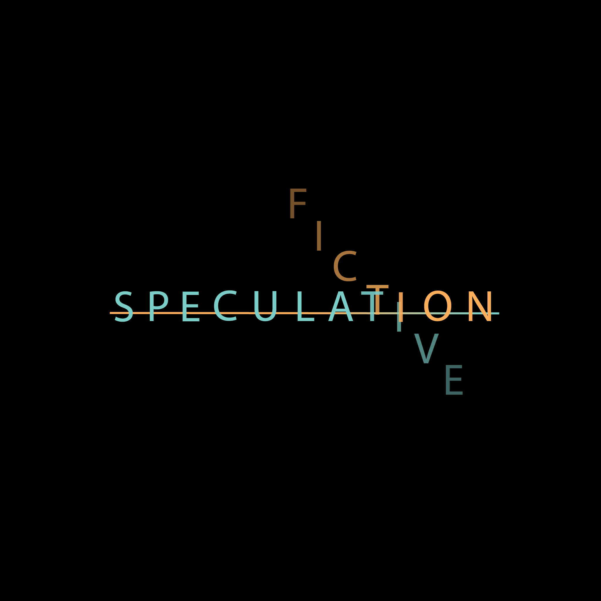

Speculation is a book club at UIUC dedicated to discussing speculative fiction as a community.

## What is Speculative Fiction?
From goodreads: 
> Speculative fiction is a fiction genre speculating about worlds that are unlike the real world in various important ways. In these contexts, it generally overlaps one or more of the following: science fiction, fantasy fiction, horror fiction, supernatural fiction, superhero fiction, utopian and dystopian fiction, apocalyptic and post-apocalyptic fiction, and alternate history. It is often used as an umbrella term for science fiction and fantasy considered as a single genre.

## Why make a new club, when we already have a book club on campus??
As stated above, we are a club dedicated to discussing *speculative fiction*. While other clubs may focus on a wide range of books, our club plans to focus only on this particular genre so that speculative fiction fans such as ourselves may have more of a devoted space to discuss this passion.
